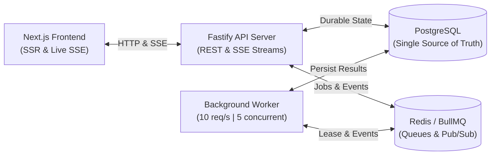
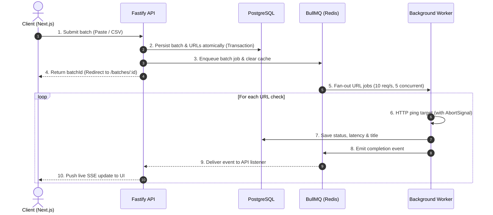
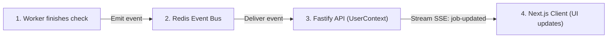
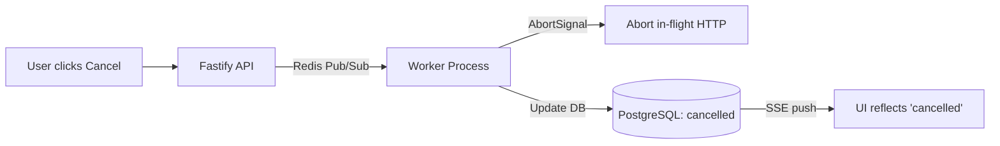
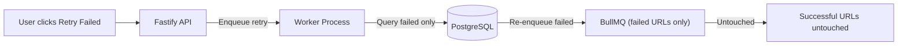

# System Architecture & Loom Walkthrough Diagrams

Visual reference diagrams for the 3–5 minute Loom walkthrough.

---

## 1. System Topology

Separation of concerns between the frontend, API server, background worker, and shared state stores.

---

## 2. Batch Processing Lifecycle

End-to-end lifecycle showing transactional pre-persistence, rate-limited processing, and live SSE streaming.

---

## 3. Real-Time Live Updates (SSE)

How worker completion events flow to the browser without client polling.

---

## 4. Cancellation & Retry Flows

### A. Cancel Batch Flow
Halts both queued and in-flight checks safely.

### B. Retry Failed Only Flow
Re-executes only failed URLs without repeating finished work.

---

## 5. Loom Video Talking Points (3–5 Minutes)

| Time | Topic | Diagram to Show | Key Points to Mention |
| :--- | :--- | :--- | :--- |
| **0:00 - 1:00** | **Architecture & Topology** | Diagram 1 (System Topology) | Core separation: Next.js frontend, Fastify API, PostgreSQL (durable truth), Redis (BullMQ queue & pub/sub), and the isolated background worker process. |
| **1:00 - 1:45** | **Submission & Durability** | Diagram 2 (Batch Lifecycle) | Emphasize **pre-persistence**: batch & URLs are committed in PostgreSQL inside an atomic transaction before queue dispatch. Explain exponential backoff (up to 3 retries). |
| **1:45 - 2:30** | **Rate Limiting & Live Updates** | Diagram 3 (Live Updates via SSE) | Explain that rate limiting (10 req/s) and concurrency (5 in flight) are enforced via BullMQ/Redis. Explain why SSE was chosen over WebSockets (unidirectional, lightweight, auto-reconnect). |
| **2:30 - 3:15** | **Idempotency, Cancel & Retry** | Diagram 4 (Cancel & Retry) | Show how deterministic `jobId: url.id` prevents duplicate jobs. Explain how Cancel uses `AbortSignal` for in-flight requests and DB checks for queued ones. Show "Retry Failed Only" isolating failed work. |
| **3:15 - 4:00** | **Trade-offs & Scaling** | README Sections 10 & 11 | Mention how the stateless API and worker design can easily be scaled horizontally behind a load balancer because state is centralized in PostgreSQL and Redis. |
